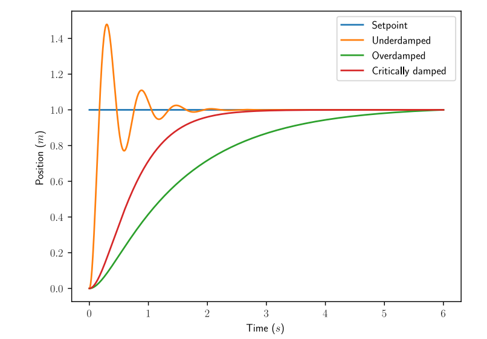

## PID Controllers

The PID controller is a commonly used feedback controller consisting of proportional,
integral, and derivative terms, hence the name.

$u(t) = K_p e(t) + K_i \int_0^t e(\tau) \,d\tau + K_d \frac{de}{dt}$

#### Proportional Term

Proportional gains act like “software-defined springs” that pull the system toward the
desired position. Recall from physics that we model springs as F = −kx where F
is the force applied, k is a proportional constant, and x is the displacement from the
equilibrium point. This can be written another way as F = k(0 − x) where 0 is the
equilibrium point. If we let the equilibrium point be our feedback controller’s set point,
the equations have a one-to-one correspondence

#### Integral Term

The Integral term accumulates the area between the set point and output plots over time
(i.e., the integral of position error) and adds the current total to the control input.
Accumulating the area between two curves is called integration.

#### Derivative Term

The Derivative term drives the velocity error to zero.

### Implementation

```rust copy
use wpilib::math::controllers::pid::PIDController;

let mut controller = PIDController::new(0.1, 0.01, 0.0);

controller.set_set_point(target);

let output = controller.calculate(position, 20);
```

### Response Types

A system driven by a PID controller generally has three types of responses: under-damped, over-damped, and critically
damped.



For the step responses in the figure above, rise time is the time the system takes to initially reach the reference
after applying the step input. Settling time is the time the system takes to settle at the reference after the step
input is applied.

An under-damped response oscillates around the reference before settling. An over-damped response is slow to rise and
does not overshoot the reference. A critically damped response has the shortest rise time without oscillating around the
reference (i.e., overshooting then undershooting)

### Tuning

These steps apply to position PID controllers. Velocity PID controllers typically don’t
need Kd.

1. Set Kp, Ki, and Kd to zero.
2. Increase Kp until the output starts to oscillate around the set point.
3. Increase Kd as much as possible without introducing littering in the system response.

import { Callout } from "nextra/components";
import Link from "next/link";

<Callout>
  <Link href="https://file.tavsys.net/control/controls-engineering-in-frc.pdf">
    <p>This comes Tyler's book Controls Engineering in FRC</p>
  </Link>
</Callout>
